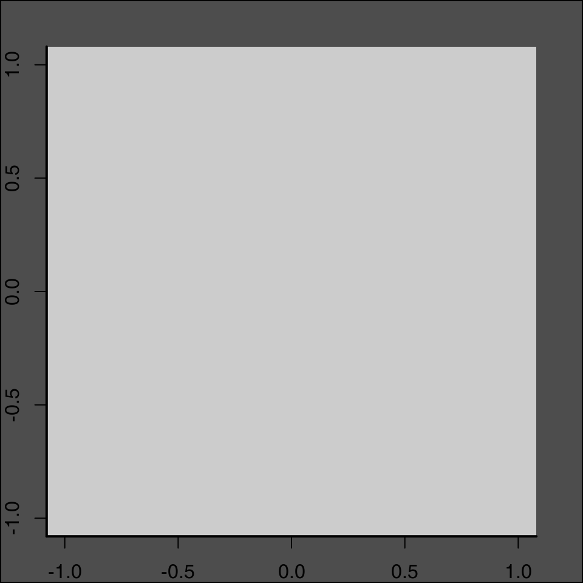
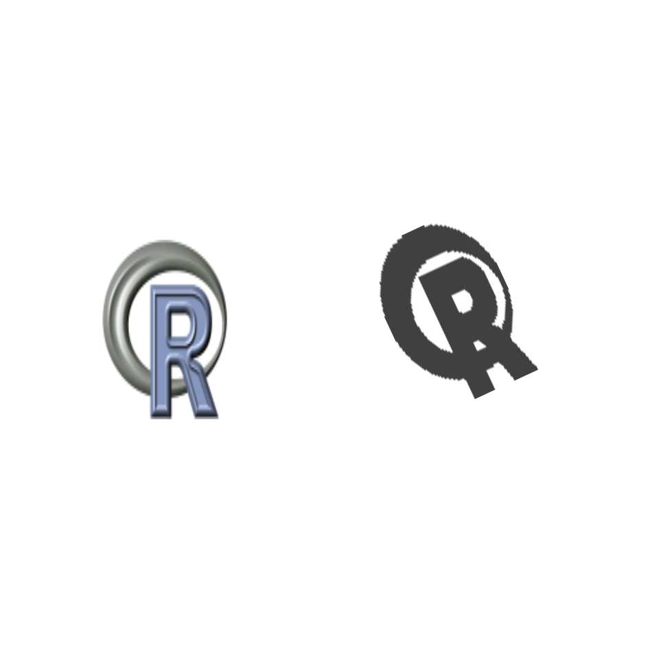
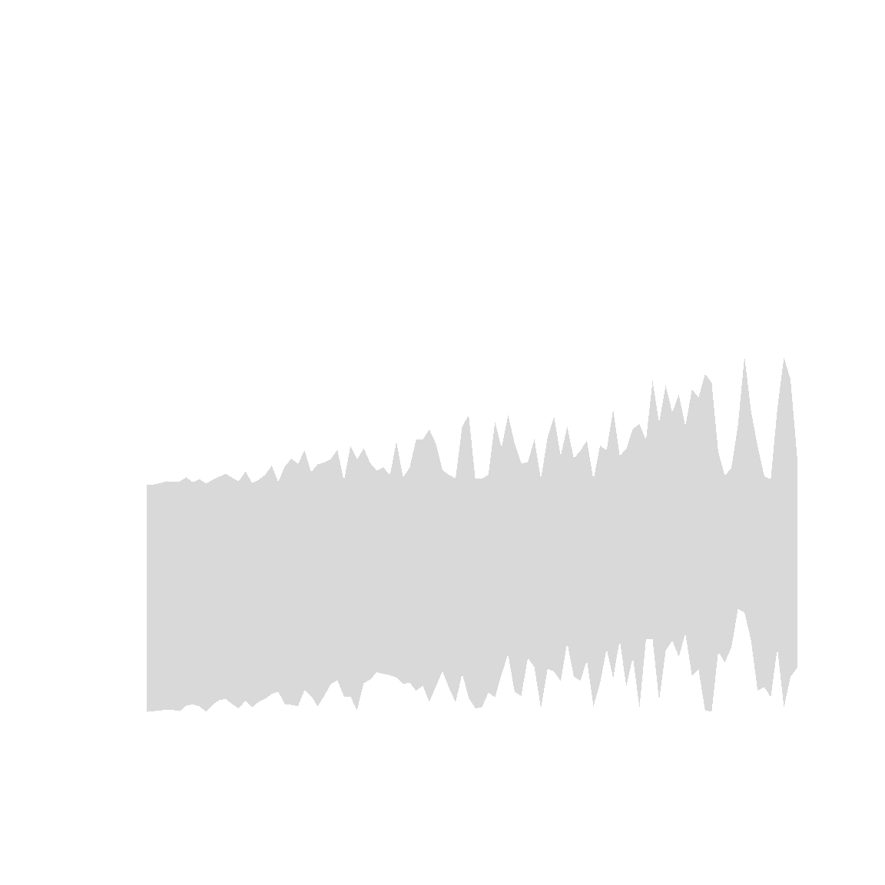
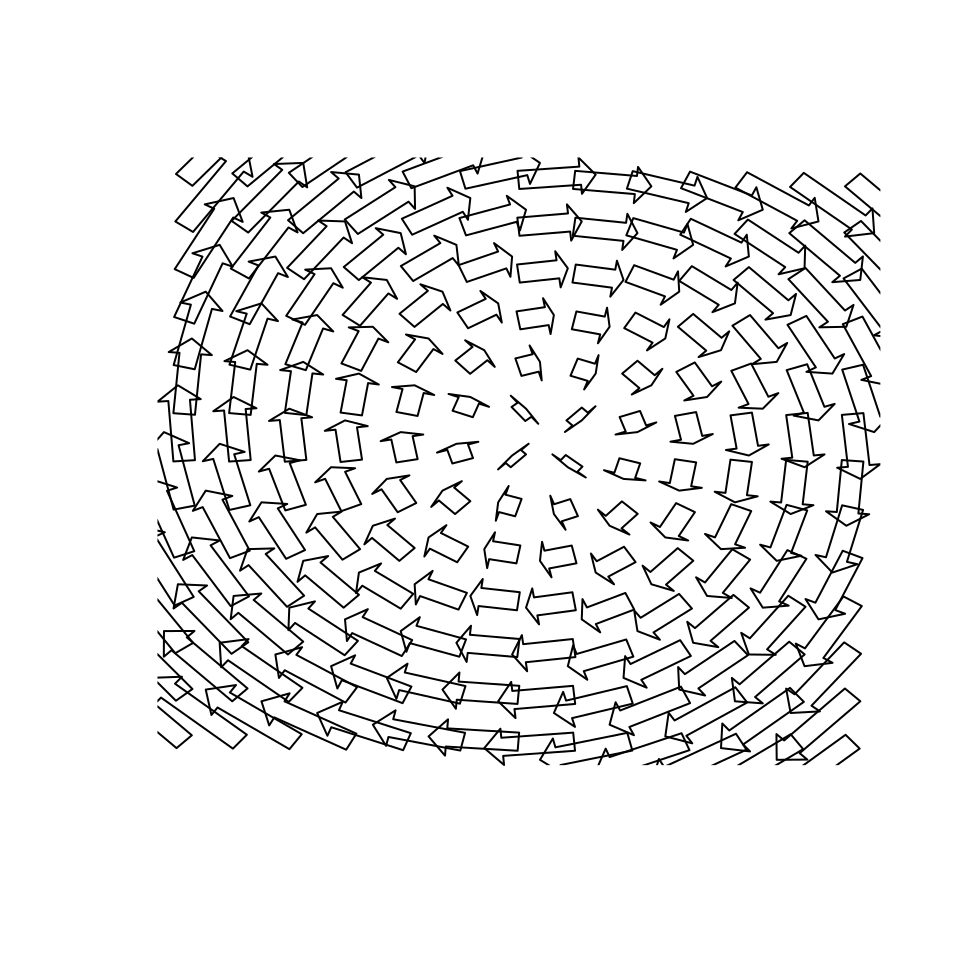
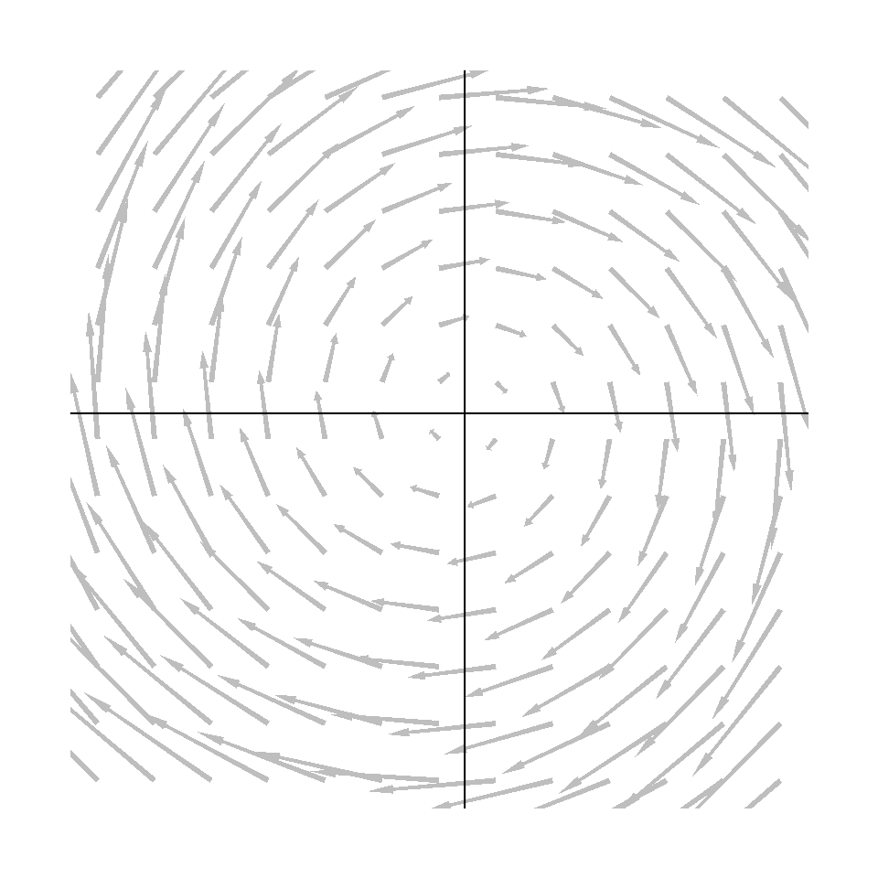

Description
===========

The *graphicsutils* is an R package that add various graphics utilities based on the core package *graphics*. For now, I do not intend to submit this package to the CRAN. First, because similar functions already exist elsewhere (see the [*plotrix*](http://cran.r-project.org/web/packages/plotrix/index.html) package). Second, because I use this package to improve my coding skills, not being on the CRAN allows me some liberty, *e.g* making some functions/arguments disappear without having to explain why :smile\_cat:! Nevertheless, this package may help users to overcome some difficulties they may encounter with *graphics*.

Also, as *graphicsutils* is based on the *graphics* package, it is not designed to work with the [*grid*](https://stat.ethz.ch/R-manual/R-devel/library/grid/html/grid-package.html) system (and thereby it does not work with [ggplot2](http://cran.r-project.org/web/packages/ggplot2/index.html)).

Status
------

[](https://ci.appveyor.com/project/KevCaz/graphicsutils) [](https://travis-ci.org/KevCaz/graphicsutils) [](https://codecov.io/gh/KevCaz/graphicsutils) [](http://www.gnu.org/licenses/gpl.html)

-   Note that functions are written using Camel case (e.g. `showPalette()`)

Installation
============

To install the package, the easiest way is to use the [*devtools*](http://cran.r-project.org/web/packages/devtools/index.html) package:

``` r
install.packages("devtools")
devtools::install_github("KevCaz/graphicsutils")
```

Then, load it:

``` r
library(graphicsutils)
```

<!-- use devel version -->
Main features
=============

Empty your plot
---------------

To start a figure from scratch it is often useful to get a plot without nothing but the correct size of axes. `plot0()` allows the user to do so:

``` r
plot0(c(0,1),c(0,1))
```


Empty, isn't it? Also, it can be filled with any color using the `fill` parameter.

``` r
plot0(c(0,1),c(0,1), fill="lightskyblue1")
```


Add a box
---------

The `box2` function allows the user to add any axes around the plot in a more flexible way.

``` r
par(mar=rep(2,4))
plot0()
box2(which="figure", lwd=2, fill="grey30")
box2(side=12, lwd=2, fill="grey80")
axis(1)
axis(2)
```



Encircle points
---------------

``` r
coords <- cbind(runif(10), runif(10))
plot0(coords)
points(coords, bg="grey25", pch=21)
encircle(coords, border="#7b11a1", lwd=2)
```


Add an image
------------

The `pchImage()` function eases the uses of `rasterImage()` to add images (including png and jpeg files) on a graph. It allows to change the color of the whole image.

``` r
pathLogo <- system.file("img", "Rlogo.png", package="png")
par(mar=c(4,1,4,1), mfrow=c(1,2))
plot0()
pchImage(0, 0, file=pathLogo, cex.x =4.5, cex.y=4)
plot0()
pchImage(0, 0, file=pathLogo, cex.x =4.5, cex.y=4, col="grey25", angle=25)
```



A stacked areas chart
---------------------

### A simple stacked areas

``` r
plot0(c(0, 10),c(0, 10))
sz <- 100
seqx <- seq(0, 10, length.out=sz)
seqy1 <- 0.2*seqx*runif(sz, 0, 1)
seqy2 <- 4+0.25*seqx*runif(sz, 0, 1)
seqy3 <- 8+0.25*seqx*runif(sz, 0, 1)
envelop(seqx, seqy1, seqy2, col="grey85", border=NA)
```



    #> $x
    #>   [1]  0.0000000  0.1010101  0.2020202  0.3030303  0.4040404  0.5050505
    #>   [7]  0.6060606  0.7070707  0.8080808  0.9090909  1.0101010  1.1111111
    #>  [13]  1.2121212  1.3131313  1.4141414  1.5151515  1.6161616  1.7171717
    #>  [19]  1.8181818  1.9191919  2.0202020  2.1212121  2.2222222  2.3232323
    #>  [25]  2.4242424  2.5252525  2.6262626  2.7272727  2.8282828  2.9292929
    #>  [31]  3.0303030  3.1313131  3.2323232  3.3333333  3.4343434  3.5353535
    #>  [37]  3.6363636  3.7373737  3.8383838  3.9393939  4.0404040  4.1414141
    #>  [43]  4.2424242  4.3434343  4.4444444  4.5454545  4.6464646  4.7474747
    #>  [49]  4.8484848  4.9494949  5.0505051  5.1515152  5.2525253  5.3535354
    #>  [55]  5.4545455  5.5555556  5.6565657  5.7575758  5.8585859  5.9595960
    #>  [61]  6.0606061  6.1616162  6.2626263  6.3636364  6.4646465  6.5656566
    #>  [67]  6.6666667  6.7676768  6.8686869  6.9696970  7.0707071  7.1717172
    #>  [73]  7.2727273  7.3737374  7.4747475  7.5757576  7.6767677  7.7777778
    #>  [79]  7.8787879  7.9797980  8.0808081  8.1818182  8.2828283  8.3838384
    #>  [85]  8.4848485  8.5858586  8.6868687  8.7878788  8.8888889  8.9898990
    #>  [91]  9.0909091  9.1919192  9.2929293  9.3939394  9.4949495  9.5959596
    #>  [97]  9.6969697  9.7979798  9.8989899 10.0000000 10.0000000  9.8989899
    #> [103]  9.7979798  9.6969697  9.5959596  9.4949495  9.3939394  9.2929293
    #> [109]  9.1919192  9.0909091  8.9898990  8.8888889  8.7878788  8.6868687
    #> [115]  8.5858586  8.4848485  8.3838384  8.2828283  8.1818182  8.0808081
    #> [121]  7.9797980  7.8787879  7.7777778  7.6767677  7.5757576  7.4747475
    #> [127]  7.3737374  7.2727273  7.1717172  7.0707071  6.9696970  6.8686869
    #> [133]  6.7676768  6.6666667  6.5656566  6.4646465  6.3636364  6.2626263
    #> [139]  6.1616162  6.0606061  5.9595960  5.8585859  5.7575758  5.6565657
    #> [145]  5.5555556  5.4545455  5.3535354  5.2525253  5.1515152  5.0505051
    #> [151]  4.9494949  4.8484848  4.7474747  4.6464646  4.5454545  4.4444444
    #> [157]  4.3434343  4.2424242  4.1414141  4.0404040  3.9393939  3.8383838
    #> [163]  3.7373737  3.6363636  3.5353535  3.4343434  3.3333333  3.2323232
    #> [169]  3.1313131  3.0303030  2.9292929  2.8282828  2.7272727  2.6262626
    #> [175]  2.5252525  2.4242424  2.3232323  2.2222222  2.1212121  2.0202020
    #> [181]  1.9191919  1.8181818  1.7171717  1.6161616  1.5151515  1.4141414
    #> [187]  1.3131313  1.2121212  1.1111111  1.0101010  0.9090909  0.8080808
    #> [193]  0.7070707  0.6060606  0.5050505  0.4040404  0.3030303  0.2020202
    #> [199]  0.1010101  0.0000000
    #> 
    #> $y
    #>   [1] 0.000000000 0.011380348 0.012250577 0.010373360 0.024008865
    #>   [6] 0.024568700 0.037440131 0.034340859 0.005975999 0.101823525
    #>  [11] 0.059653096 0.135703447 0.010855409 0.235796799 0.279067438
    #>  [16] 0.258301570 0.031420459 0.113307404 0.013768043 0.186263568
    #>  [21] 0.090831698 0.341161607 0.273808001 0.251197649 0.430319453
    #>  [26] 0.065450214 0.294933918 0.166164414 0.011896824 0.175853717
    #>  [31] 0.353713363 0.178623529 0.628172784 0.164689065 0.342103452
    #>  [36] 0.344329781 0.425616701 0.612944514 0.698883404 0.546697948
    #>  [41] 0.317952154 0.564634212 0.057479239 0.638509197 0.275844962
    #>  [46] 0.540962137 0.610589653 0.939889723 0.003163567 0.943049959
    #>  [51] 0.118636909 0.664595675 0.174333376 0.581312622 0.373933383
    #>  [56] 0.158818897 0.489691390 0.064959834 0.245184983 0.075908183
    #>  [61] 0.481751057 0.694322120 0.333817792 0.016344485 0.517529083
    #>  [66] 0.441994855 0.402203625 0.886665106 0.448905172 0.329169244
    #>  [71] 0.049742348 0.569361385 1.267716798 0.787297129 0.609506029
    #>  [76] 1.340146043 0.129357764 0.174887417 1.436718385 0.159239420
    #>  [81] 0.951194725 0.888426972 0.457523952 1.133321792 1.600467667
    #>  [86] 0.379381526 0.011253777 0.616289708 1.085630981 1.080606582
    #>  [91] 0.495594434 0.402557673 0.766188625 1.327934855 0.041774473
    #>  [96] 0.774356061 0.011352439 0.005244594 0.070888971 0.922693552
    #> [101] 5.907705445 4.868223767 4.046925962 4.481598026 5.822305968
    #> [106] 6.334511603 4.728005688 5.271391419 4.267565026 4.714406001
    #> [111] 4.874113723 5.389376744 5.773947176 4.384737638 4.047446299
    #> [116] 4.783614523 5.042421387 5.535473246 5.596232950 4.617836711
    #> [121] 4.180004987 4.509777004 4.762249300 4.063802404 4.891565029
    #> [126] 5.619226892 4.021259300 4.567202851 4.941426195 4.049156486
    #> [131] 5.124401878 5.709409053 5.451350376 4.714910817 4.374155556
    #> [136] 5.468640459 4.706141245 4.192921728 4.798921294 5.027299339
    #> [141] 4.133806513 4.095218332 4.541130119 4.050041222 4.050418259
    #> [146] 4.604962288 5.330822047 4.731873768 4.618023033 5.049866698
    #> [151] 4.826240155 4.017711256 4.535250471 5.149139229 4.272018528
    #> [156] 5.071235415 4.221521617 5.025193584 4.779432247 4.322824769
    #> [161] 4.348495908 4.764565727 4.084209330 4.846149033 4.203843682
    #> [166] 4.130071432 4.052538197 4.591954902 4.562691953 4.460645610
    #> [171] 4.728699421 4.304816741 4.390401062 4.161245470 4.040877723
    #> [176] 4.389900421 4.081813341 4.262313505 4.088405945 4.472536406
    #> [181] 4.121982337 4.212040367 4.397719300 4.226392319 4.105621839
    #> [186] 4.003537046 4.071106656 4.124754727 4.204367106 4.248146082
    #> [191] 4.054786759 4.030711043 4.112538404 4.105395395 4.087863480
    #> [196] 4.050443382 4.023724064 4.036578249 4.017833061 4.000000000

### A complete stacked areas

``` r
x <- data.frame(matrix(runif(200, 2, 10), 8, 25))
stackedAreas(x)
```


Polar plot
----------

``` r
polarPlot(1:40, stats::runif(40), to=1.9*pi, col="grey30", border="grey80")
```


Get pretty ranges
-----------------

``` r
vec <- stats::runif(20)
range(vec)
#> [1] 0.1914605 0.9157160
prettyRange(vec)
#> [1] 0.15 0.95
prettyRange(c(3.85, 3.88245))
#> [1] 3.850 3.885
```

Interactive functions
---------------------

Some functions are interactive and fairly understandable! So, I suggest you try the following functions:

``` r
pickColors()
```

``` r
layout2()
```

Colors
------

`darken()` and `lighten()` functions are convenient way to produce consistent set of colors with minimal effort. They can be displayed using the `showPalette()` function as for any color palette.

``` r
someblue <- darken("blue", 10*1:9)
showPalette(someblue)
```


``` r
somered <- lighten("red", 10*1:9)
showPalette(somered, add_codecolor=TRUE)
```


Access to Font-Awesome's icons
==============================

``` r
names <- getIconNames()
my_icon <- getIcon(name='beer', col='grey80')
#> Downloaded and stored at '/var/folders/vw/vkx0lvqd69jf9blhj1c3b3t00000gn/T//RtmpuOUTnt/icon2a2e64f01da1.png'
plotImage(my_icon)
```


Vector fields
=============

``` r
systLin <- function(X, beta){
    Y <- matrix(0,ncol=2)
    Y[1] <- beta[1,1]*X[1]+beta[1,2]*X[2]
    Y[2] <- beta[2,1]*X[1]+beta[2,2]*X[2]
    return(Y)
}
seqx <- seq(-2,2,0.31)
seqy <- seq(-2,2,0.31)
beta1 <- matrix(c(0,-1,1,0),2)
# Plot 1:
vecfield2d(coords=expand.grid(seqx, seqy), FUN=systLin, args=list(beta=beta1))
```



``` r
# Plot 2:
graphics::par(mar=c(2,2,2,2))
vecfield2d(coords=expand.grid(seqx, seqy), FUN=systLin,
   args=list(beta=beta1), cex.x=0.35, cex.arr=0.25,
   border=NA,cex.hh=1, cex.shr=0.6, col=8)
graphics::abline(v=0,h=0)
```



To do list
==========

-   \[ \] Improve the code coverage,
-   \[ \] Add a vignette gathering examples (I may create a simple cookbook website),
-   \[ \] add interactive mode in `showPalette()` function,
-   \[ \] `vectfield2d()` needs to be reviewed =&gt; I'll do so when I'll integrate nice looking arrows.
