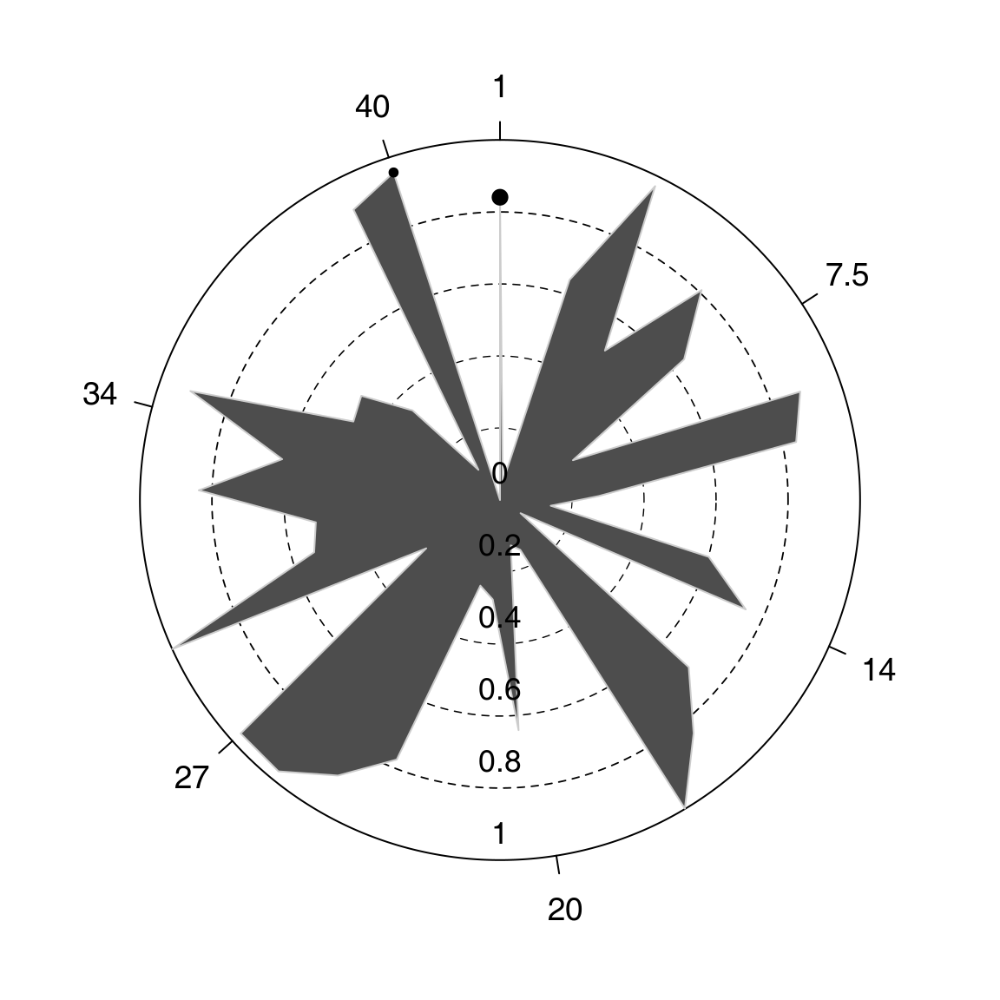
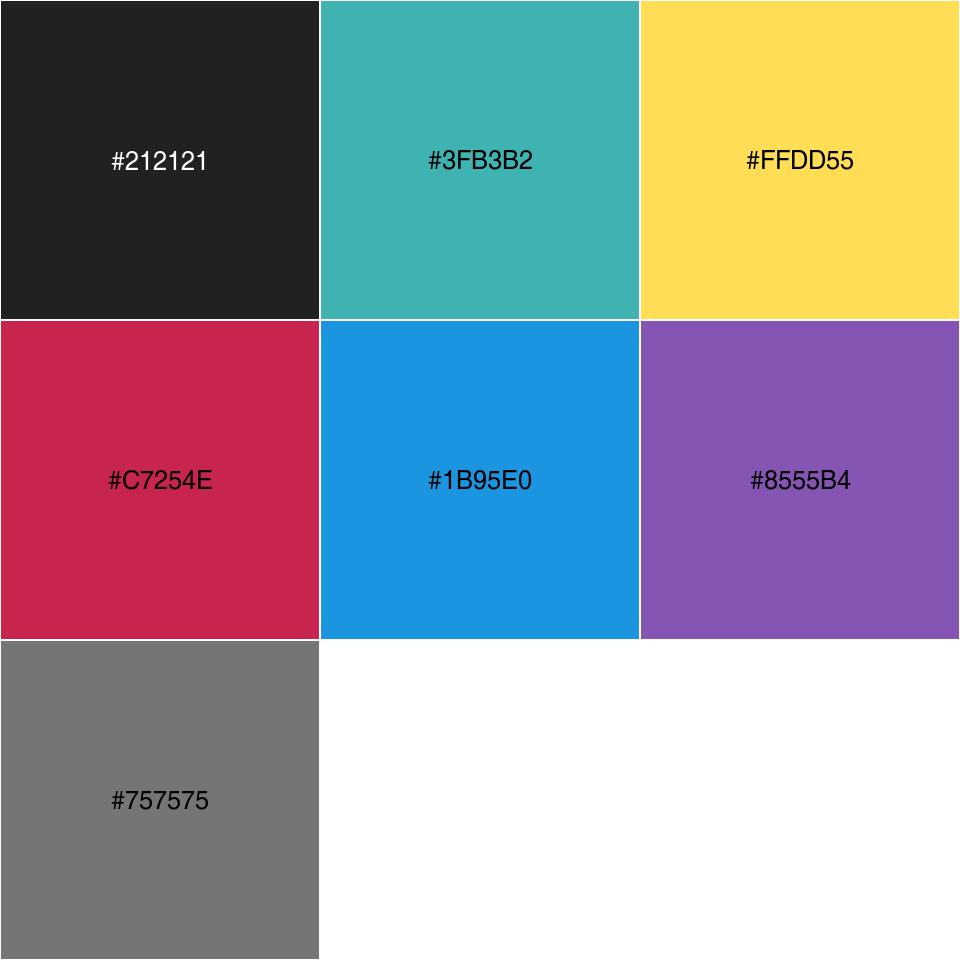

Description
===========

The *graphicsutils* is an R package that adds various graphics utilities
based on the core package *graphics*. For now, the package is dedicated
to store our graphical functions and improve our coding skills. Note
that similar functions may already exist elsewhere (most likely in the
[*plotrix*](http://cran.r-project.org/web/packages/plotrix/index.html)
package). However this package may help users to overcome some
difficulties they may encounter with *graphics*.

Also, as *graphicsutils* is based on the *graphics* package, it is not
designed to work with the
[*grid*](https://stat.ethz.ch/R-manual/R-devel/library/grid/html/grid-package.html)
system (and thereby it does not work with
[ggplot2](http://cran.r-project.org/web/packages/ggplot2/index.html)).
Related with this is one very helpful article by Paul Murrell: [The
gridGraphics
Package](https://journal.r-project.org/archive/2015-1/murrell.pdf).

Status
------

-   Note that functions are written using Camel case (e.g.
    `showPalette()`)

Installation
============

The easiest way to install `graphicsutils` is to use the
[*devtools*](http://cran.r-project.org/web/packages/devtools/index.html)
package:

    install.packages("devtools")
    devtools::install_github("inSileco/graphicsutils")

Then, load it:

    library(graphicsutils)

Main features
=============

Empty your plot
---------------

To start a figure from scratch it is often useful to get a plot without
nothing but having the correct size of axes. `plot0()` allows the user
to do so:

    plot0(c(0,1),c(0,1))

Quite empty, isn’t it? Also, it can be filled with any color using the
`fill` parameter.

    plot0(c(0,1), c(0,1), fill="lightskyblue1")

Add a box
---------

The `box2()` function allows the user to add any axes around the plot in
a more flexible way.

    par(mar=rep(2,4))
    plot0()
    box2(which="figure", lwd=2, fill="grey30")
    box2(side=12, lwd=2, fill="grey80")
    axis(1)
    axis(2)

Encircle points
---------------

    coords <- cbind(runif(10), runif(10))
    plot0(coords)
    points(coords, bg="grey25", pch=21)
    encircle(coords, border="#7b11a1", lwd=2)

Add an image
------------

The `pchImage()` function eases the uses of `rasterImage()` to add
images (including png and jpeg files) on a graph. It allows to change
the color of the whole image.

    pathLogo <- system.file("img", "Rlogo.png", package="png")
    par(mar=c(4,1,4,1), mfrow=c(1,2))
    plot0()
    pchImage(0, 0, file=pathLogo, cex.x =4.5, cex.y=4)
    plot0()
    pchImage(0, 0, file=pathLogo, cex.x =4.5, cex.y=4, col="grey25", angle=25)

A stacked areas chart
---------------------

### A simple stacked areas

    plot0(c(0, 10),c(0, 10))
    sz <- 100
    seqx <- seq(0, 10, length.out=sz)
    seqy1 <- 0.2*seqx*runif(sz, 0, 1)
    seqy2 <- 4+0.25*seqx*runif(sz, 0, 1)
    seqy3 <- 8+0.25*seqx*runif(sz, 0, 1)
    envelop(seqx, seqy1, seqy2, col="grey85", border=NA)

### A complete stacked areas

    x <- data.frame(matrix(runif(200, 2, 10), 8, 25))
    stackedAreas(x)

Polar plot
----------

    polarPlot(1:40, stats::runif(40), to=1.9*pi, col="grey30", border="grey80")

Get pretty ranges
-----------------

    vec <- stats::runif(20)
    range(vec)
    R>>  [1] 0.01253445 0.92937429
    prettyRange(vec)
    R>>  [1] 0.00 0.95
    prettyRange(c(3.85, 3.88245))
    R>>  [1] 3.850 3.885

Interactive functions
---------------------

Some functions are interactive and fairly understandable! So, I suggest
you try the following functions:

    pickColors()

    layout2()

Colors
------

`darken()` and `lighten()` functions are convenient way to produce
consistent set of shaded colors with minimal effort; also use
`showPalette()` to display your palette.

    someblue <- darken("blue", 10*1:9)
    showPalette(someblue)

    somered <- lighten("red", 10*1:9)
    showPalette(somered, add_codecolor=TRUE)

Since version 1.1-2 a set of color palettes has been added as a dataset.

    utils::data(gpu)
    showPalette(gpu$insileco, add_codecolor=TRUE)

Access to Font-Awesome’s icons
==============================

    names <- getIconNames()
    my_icon <- getIcon(name='beer', col='grey80')
    R>>  Downloaded and stored at '/tmp/Rtmp6l0isy/icon7f86295df7f2.png'
    plotImage(my_icon)

Vector fields
=============

    systLin <- function(X, beta){
        Y <- matrix(0,ncol=2)
        Y[1] <- beta[1,1]*X[1]+beta[1,2]*X[2]
        Y[2] <- beta[2,1]*X[1]+beta[2,2]*X[2]
        return(Y)
    }
    seqx <- seq(-2,2,0.31)
    seqy <- seq(-2,2,0.31)
    beta1 <- matrix(c(0,-1,1,0),2)
    # Plot 1:
    vecfield2d(coords=expand.grid(seqx, seqy), FUN=systLin, args=list(beta=beta1))

    # Plot 2:
    graphics::par(mar=c(2,2,2,2))
    vecfield2d(coords=expand.grid(seqx, seqy), FUN=systLin,
       args=list(beta=beta1), cex.x=0.35, cex.arr=0.25,
       border=NA,cex.hh=1, cex.shr=0.6, col=8)
    graphics::abline(v=0,h=0)

To do list
==========

-   \[ \] Improve the code coverage;
-   \[ \] Add a contributing section;
-   \[ \] Add a vignette gathering examples (I may create a simple
    cookbook website);
-   \[ \] add interactive mode in `showPalette()` function;
-   \[ \] `vectfield2d()` needs to be reviewed =&gt; I’ll do so when
    I’ll integrate nice looking arrows.
