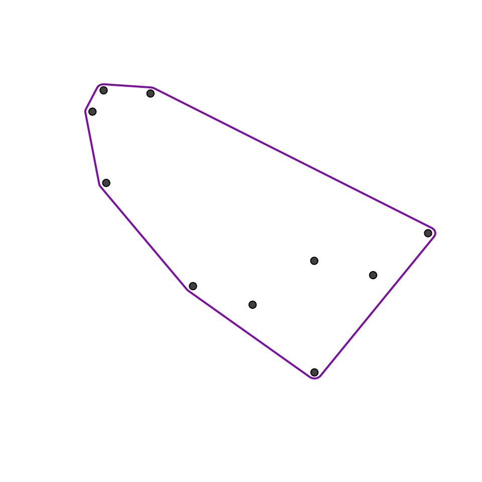
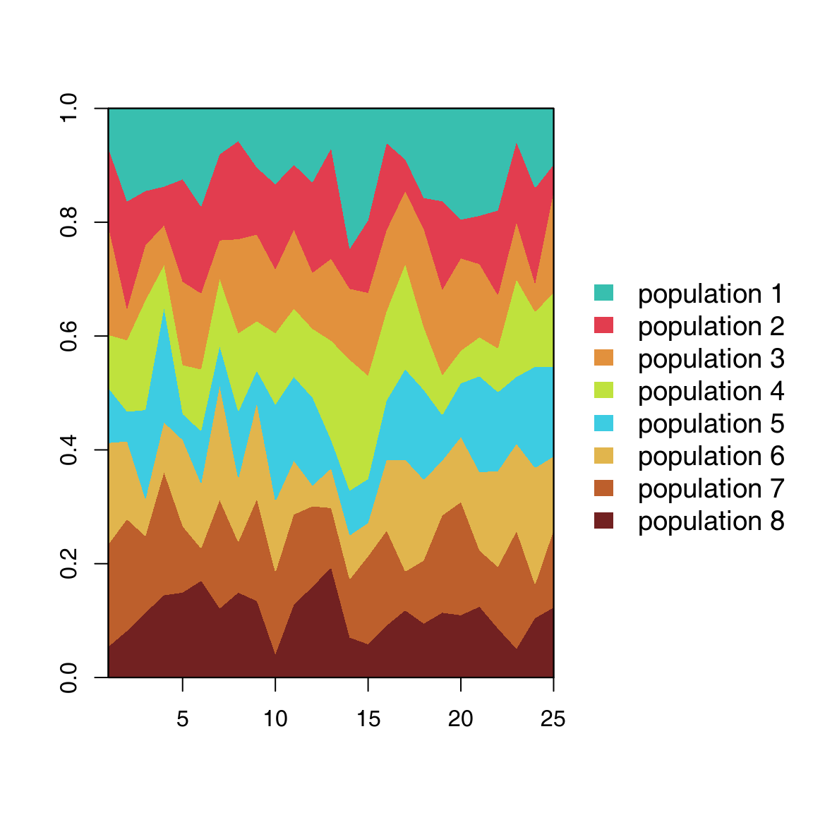

Description
===========

The *graphicsutils* is an R package that add various graphics utilities based on the core package *graphics*. For now, I do not intend to submit this package to the CRAN. First, because similar functions already exist elsewhere (see the [*plotrix*](http://cran.r-project.org/web/packages/plotrix/index.html) package). Second, because I use this package to improve my coding skills, not being on the CRAN allows me some liberty, *e.g* making some functions/arguments disappear without having to explain why :smile\_cat:! Nevertheless, this package may help users to overcome some difficulties they may encounter with *graphics*.

Also, as *graphicsutils* is based on the *graphics* package, it is not designed to work with the [*grid*](https://stat.ethz.ch/R-manual/R-devel/library/grid/html/grid-package.html) system (and thereby it does not work with [ggplot2](http://cran.r-project.org/web/packages/ggplot2/index.html)).

Status
------

[](https://travis-ci.org/inSileco/graphicsutils) [](https://ci.appveyor.com/project/KevCaz/graphicsutils-qo99s) [](http://www.gnu.org/licenses/gpl.html)

-   Note that functions are written using Camel case (e.g. `showPalette()`)

Installation
============

The easiest way to install this package is to use the [*devtools*](http://cran.r-project.org/web/packages/devtools/index.html) package:

``` r
install.packages("devtools")
devtools::install_github("KevCaz/graphicsutils")
```

Then, load it:

``` r
library(graphicsutils)
```

Main features
=============

Empty your plot
---------------

To start a figure from scratch it is often useful to get a plot without nothing but having the correct size of axes. `plot0()` allows the user to do so:

``` r
plot0(c(0,1),c(0,1))
```


Quite empty, isn't it? Also, it can be filled with any color using the `fill` parameter.

``` r
plot0(c(0,1), c(0,1), fill="lightskyblue1")
```


Add a box
---------

The `box2` function allows the user to add any axes around the plot in a more flexible way.

``` r
par(mar=rep(2,4))
plot0()
box2(which="figure", lwd=2, fill="grey30")
box2(side=12, lwd=2, fill="grey80")
axis(1)
axis(2)
```


Encircle points
---------------

``` r
coords <- cbind(runif(10), runif(10))
plot0(coords)
points(coords, bg="grey25", pch=21)
encircle(coords, border="#7b11a1", lwd=2)
```



Add an image
------------

The `pchImage()` function eases the uses of `rasterImage()` to add images (including png and jpeg files) on a graph. It allows to change the color of the whole image.

``` r
pathLogo <- system.file("img", "Rlogo.png", package="png")
par(mar=c(4,1,4,1), mfrow=c(1,2))
plot0()
pchImage(0, 0, file=pathLogo, cex.x =4.5, cex.y=4)
plot0()
pchImage(0, 0, file=pathLogo, cex.x =4.5, cex.y=4, col="grey25", angle=25)
```


A stacked areas chart
---------------------

### A simple stacked areas

``` r
plot0(c(0, 10),c(0, 10))
sz <- 100
seqx <- seq(0, 10, length.out=sz)
seqy1 <- 0.2*seqx*runif(sz, 0, 1)
seqy2 <- 4+0.25*seqx*runif(sz, 0, 1)
seqy3 <- 8+0.25*seqx*runif(sz, 0, 1)
envelop(seqx, seqy1, seqy2, col="grey85", border=NA)
```


    R>>  $x
    R>>    [1]  0.0000000  0.1010101  0.2020202  0.3030303  0.4040404  0.5050505
    R>>    [7]  0.6060606  0.7070707  0.8080808  0.9090909  1.0101010  1.1111111
    R>>   [13]  1.2121212  1.3131313  1.4141414  1.5151515  1.6161616  1.7171717
    R>>   [19]  1.8181818  1.9191919  2.0202020  2.1212121  2.2222222  2.3232323
    R>>   [25]  2.4242424  2.5252525  2.6262626  2.7272727  2.8282828  2.9292929
    R>>   [31]  3.0303030  3.1313131  3.2323232  3.3333333  3.4343434  3.5353535
    R>>   [37]  3.6363636  3.7373737  3.8383838  3.9393939  4.0404040  4.1414141
    R>>   [43]  4.2424242  4.3434343  4.4444444  4.5454545  4.6464646  4.7474747
    R>>   [49]  4.8484848  4.9494949  5.0505051  5.1515152  5.2525253  5.3535354
    R>>   [55]  5.4545455  5.5555556  5.6565657  5.7575758  5.8585859  5.9595960
    R>>   [61]  6.0606061  6.1616162  6.2626263  6.3636364  6.4646465  6.5656566
    R>>   [67]  6.6666667  6.7676768  6.8686869  6.9696970  7.0707071  7.1717172
    R>>   [73]  7.2727273  7.3737374  7.4747475  7.5757576  7.6767677  7.7777778
    R>>   [79]  7.8787879  7.9797980  8.0808081  8.1818182  8.2828283  8.3838384
    R>>   [85]  8.4848485  8.5858586  8.6868687  8.7878788  8.8888889  8.9898990
    R>>   [91]  9.0909091  9.1919192  9.2929293  9.3939394  9.4949495  9.5959596
    R>>   [97]  9.6969697  9.7979798  9.8989899 10.0000000 10.0000000  9.8989899
    R>>  [103]  9.7979798  9.6969697  9.5959596  9.4949495  9.3939394  9.2929293
    R>>  [109]  9.1919192  9.0909091  8.9898990  8.8888889  8.7878788  8.6868687
    R>>  [115]  8.5858586  8.4848485  8.3838384  8.2828283  8.1818182  8.0808081
    R>>  [121]  7.9797980  7.8787879  7.7777778  7.6767677  7.5757576  7.4747475
    R>>  [127]  7.3737374  7.2727273  7.1717172  7.0707071  6.9696970  6.8686869
    R>>  [133]  6.7676768  6.6666667  6.5656566  6.4646465  6.3636364  6.2626263
    R>>  [139]  6.1616162  6.0606061  5.9595960  5.8585859  5.7575758  5.6565657
    R>>  [145]  5.5555556  5.4545455  5.3535354  5.2525253  5.1515152  5.0505051
    R>>  [151]  4.9494949  4.8484848  4.7474747  4.6464646  4.5454545  4.4444444
    R>>  [157]  4.3434343  4.2424242  4.1414141  4.0404040  3.9393939  3.8383838
    R>>  [163]  3.7373737  3.6363636  3.5353535  3.4343434  3.3333333  3.2323232
    R>>  [169]  3.1313131  3.0303030  2.9292929  2.8282828  2.7272727  2.6262626
    R>>  [175]  2.5252525  2.4242424  2.3232323  2.2222222  2.1212121  2.0202020
    R>>  [181]  1.9191919  1.8181818  1.7171717  1.6161616  1.5151515  1.4141414
    R>>  [187]  1.3131313  1.2121212  1.1111111  1.0101010  0.9090909  0.8080808
    R>>  [193]  0.7070707  0.6060606  0.5050505  0.4040404  0.3030303  0.2020202
    R>>  [199]  0.1010101  0.0000000
    R>>  
    R>>  $y
    R>>    [1] 0.000000000 0.009245994 0.017062346 0.029630110 0.061775165
    R>>    [6] 0.008354209 0.024857291 0.108827211 0.073041995 0.164584325
    R>>   [11] 0.170874910 0.037647861 0.108188583 0.235156288 0.074664590
    R>>   [16] 0.167655329 0.293463939 0.142593595 0.185681927 0.223924789
    R>>   [21] 0.174722756 0.123533984 0.019909159 0.015120372 0.483929157
    R>>   [26] 0.233927883 0.452815559 0.514630850 0.459927592 0.500257038
    R>>   [31] 0.433527173 0.252908346 0.321030285 0.249629460 0.204218708
    R>>   [36] 0.176071739 0.250198143 0.323332312 0.108124256 0.398161204
    R>>   [41] 0.296896681 0.412978040 0.079887617 0.223516279 0.416501514
    R>>   [46] 0.088063724 0.903957349 0.928386388 0.248711643 0.867334099
    R>>   [51] 0.965136614 0.244951670 1.026534567 0.870594031 0.285890899
    R>>   [56] 0.608129074 0.301877146 0.254223534 1.121691624 1.167777418
    R>>   [61] 0.671120701 1.040689869 1.202210678 0.845240220 1.284831361
    R>>   [66] 0.996668096 1.039846312 0.225862358 1.222476820 0.881028564
    R>>   [71] 0.802615338 1.241687820 0.758867826 0.217596317 0.538705389
    R>>   [76] 0.867755956 0.866534564 0.464316860 1.301286875 0.684527484
    R>>   [81] 0.211721541 0.973496798 0.919586097 1.586999154 0.852062833
    R>>   [86] 0.294751940 1.485508286 0.360395289 0.145365289 1.110021129
    R>>   [91] 0.184568164 0.041976025 0.351581836 1.546144151 0.840011377
    R>>   [96] 0.503342280 1.352520424 0.976802698 1.643000324 0.864083636
    R>>  [101] 4.448558104 5.572574859 4.991780092 4.875297882 5.064050117
    R>>  [106] 4.493959917 4.989277112 4.096270858 5.304187055 4.666583141
    R>>  [111] 4.899470372 4.050567978 5.241902270 5.807160302 4.249970172
    R>>  [116] 4.195113588 5.479059235 5.757103860 5.707710514 4.909776591
    R>>  [121] 4.984352470 4.505446363 4.738655520 5.665175317 5.019282812
    R>>  [126] 5.171873458 5.083547383 4.250634526 4.445817138 5.401844311
    R>>  [131] 4.445294452 4.346380059 4.659460395 4.800138541 5.441827545
    R>>  [136] 4.790289230 5.449974382 5.089070144 4.699205707 4.550758052
    R>>  [141] 5.459995369 4.446721690 5.285429631 5.042703804 4.973004178
    R>>  [146] 5.184990212 4.958249304 4.007419108 5.240105422 5.056826203
    R>>  [151] 4.552098800 4.989432023 4.030044732 4.139148705 4.709715745
    R>>  [156] 4.973868546 4.145847434 4.655678442 4.872414698 4.676180318
    R>>  [161] 4.496133065 4.374352724 4.180267884 4.376029470 4.123834080
    R>>  [166] 4.367434181 4.322079114 4.661037745 4.157540014 4.041713261
    R>>  [171] 4.274517540 4.116362253 4.522927546 4.226765211 4.414258301
    R>>  [176] 4.233009445 4.575071519 4.530665518 4.194897766 4.177709356
    R>>  [181] 4.467323880 4.065416458 4.065693832 4.373013726 4.143650430
    R>>  [186] 4.030577234 4.201013653 4.281517571 4.125999217 4.018493783
    R>>  [191] 4.197583589 4.115532370 4.060160083 4.039795925 4.101692059
    R>>  [196] 4.041255330 4.036917623 4.015070736 4.012949125 4.000000000

### A complete stacked areas

``` r
x <- data.frame(matrix(runif(200, 2, 10), 8, 25))
stackedAreas(x)
```



Polar plot
----------

``` r
polarPlot(1:40, stats::runif(40), to=1.9*pi, col="grey30", border="grey80")
```


Get pretty ranges
-----------------

``` r
vec <- stats::runif(20)
range(vec)
R>>  [1] 0.06902428 0.98356272
prettyRange(vec)
R>>  [1] 0.05 1.00
prettyRange(c(3.85, 3.88245))
R>>  [1] 3.850 3.885
```

Interactive functions
---------------------

Some functions are interactive and fairly understandable! So, I suggest you try the following functions:

``` r
pickColors()
```

``` r
layout2()
```

Colors
------

`darken()` and `lighten()` functions are convenient way to produce consistent set of colors with minimal effort. They can be displayed using the `showPalette()` function as for any color palette.

``` r
someblue <- darken("blue", 10*1:9)
showPalette(someblue)
```


``` r
somered <- lighten("red", 10*1:9)
showPalette(somered, add_codecolor=TRUE)
```


Access to Font-Awesome's icons
==============================

``` r
names <- getIconNames()
my_icon <- getIcon(name='beer', col='grey80')
R>>  Downloaded and stored at '/tmp/Rtmpn1jdya/icon3bf7359b66a0.png'
plotImage(my_icon)
```


Vector fields
=============

``` r
systLin <- function(X, beta){
    Y <- matrix(0,ncol=2)
    Y[1] <- beta[1,1]*X[1]+beta[1,2]*X[2]
    Y[2] <- beta[2,1]*X[1]+beta[2,2]*X[2]
    return(Y)
}
seqx <- seq(-2,2,0.31)
seqy <- seq(-2,2,0.31)
beta1 <- matrix(c(0,-1,1,0),2)
# Plot 1:
vecfield2d(coords=expand.grid(seqx, seqy), FUN=systLin, args=list(beta=beta1))
```


``` r
# Plot 2:
graphics::par(mar=c(2,2,2,2))
vecfield2d(coords=expand.grid(seqx, seqy), FUN=systLin,
   args=list(beta=beta1), cex.x=0.35, cex.arr=0.25,
   border=NA,cex.hh=1, cex.shr=0.6, col=8)
graphics::abline(v=0,h=0)
```


To do list
==========

-   \[ \] Improve the code coverage,
-   \[ \] Add a contributing section
-   \[ \] Add a vignette gathering examples (I may create a simple cookbook website),
-   \[ \] add interactive mode in `showPalette()` function,
-   \[ \] `vectfield2d()` needs to be reviewed =&gt; I'll do so when I'll integrate nice looking arrows.
