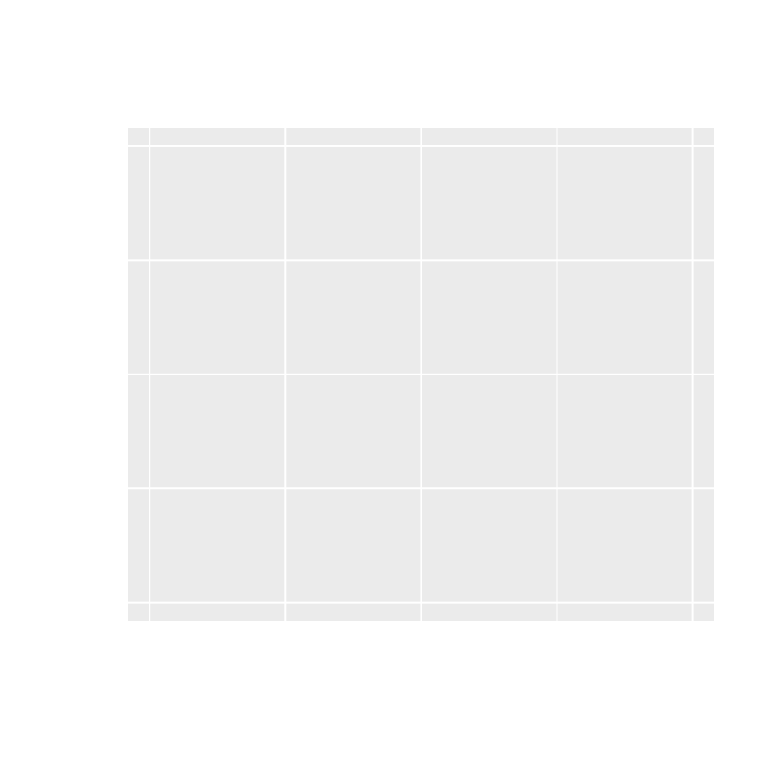
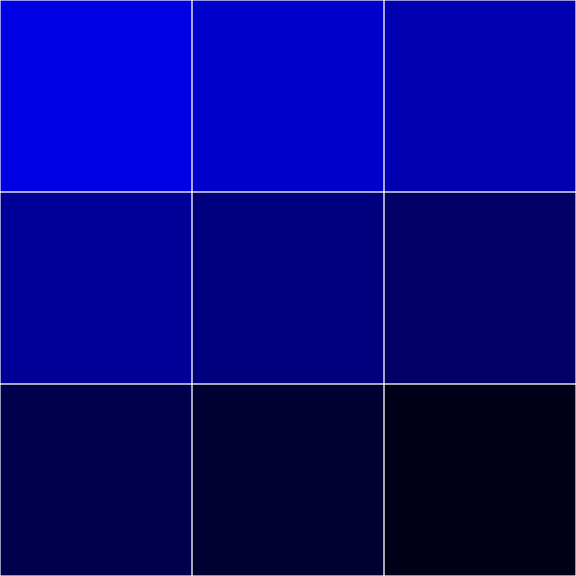
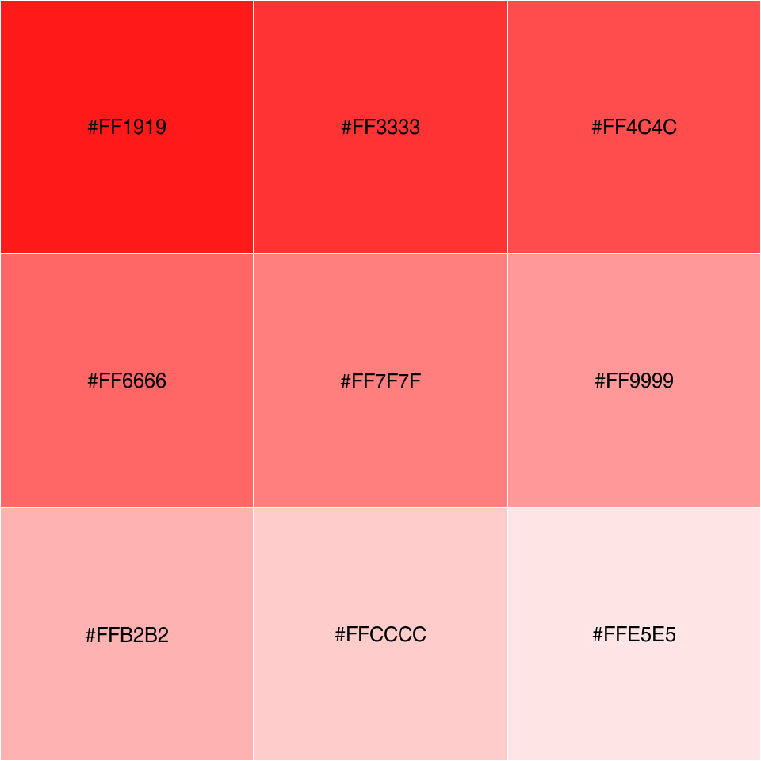
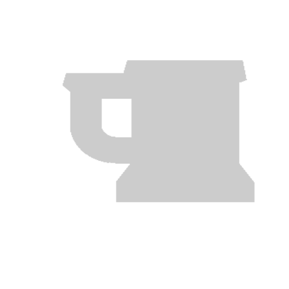

Description
===========

The *graphicsutils* R package includes a set of graphical functions. Just as the [*plotrix*](http://cran.r-project.org/web/packages/plotrix/index.html) package, it adds several graphics utilities based on the core package *graphics*.

For now, I do not intend to submit this package to the CRAN. First, because similar functions already exist elsewhere (in [*plotrix*](http://cran.r-project.org/web/packages/plotrix/index.html) for instance) and I do not increase the code redundancy on the CRAN! Second, because I use this package to improve my coding skills, not being on the CRAN allows me some liberty, *e.g* making some functions/arguments disappearing without me explaining why! Nevertheless, this package may help users to deal with typical issues they may encounter when they use *graphics*.

Also, *graphicsutils* is base on the *graphics* package and so, it is not intended to be used with the [*grid*](https://stat.ethz.ch/R-manual/R-devel/library/grid/html/grid-package.html) sytem (and thus neither with [ggplot2](http://cran.r-project.org/web/packages/ggplot2/index.html)).

Status
------

[](https://ci.appveyor.com/project/KevCaz/graphicsutils) [](https://travis-ci.org/KevCaz/graphicsutils) [](https://codecov.io/gh/KevCaz/graphicsutils) [](http://www.gnu.org/licenses/gpl.html)

-   Note that functions are written using Camel case (e.g. `showPalette()`)

Installation
============

To install the package, use the [*devtools*](http://cran.r-project.org/web/packages/devtools/index.html) package:

``` r
install.packages("devtools")
devtools::install_github("KevCaz/graphicsutils")
```

Then, load it:

``` r
library(graphicsutils)
```

<!-- use devel version -->
Main features
=============

Empty your plot
---------------

To start a figure from scratch it is often useful to get a plot without nothing but the correct size of axes. `plot0()` allows the user to do so:

``` r
plot0(c(0,1),c(0,1))
```


Empty, isn't it? Also, it can be filled with any color using the `fill` parameter.

``` r
plot0(c(0,1),c(0,1), fill="lightskyblue1")
```



Add a box
---------

The `box2` function allows the user to add any axes around the plot in a more flexible way.

``` r
par(mar=rep(2,4))
plot0()
box2(which="figure", lwd=2, fill="grey30")
box2(side=12, lwd=2, fill="grey80")
axis(1)
axis(2)
```


Add an image
------------

The `pchImage()` function eases the uses of `rasterImage()` to add images (including png and jpeg files) on a graph. It allows to change the color of the whole image.

``` r
pathLogo <- system.file("img", "Rlogo.png", package="png")
par(mar=c(4,1,4,1), mfrow=c(1,2))
plot0()
pchImage(0, 0, file=pathLogo, cex.x =4.5, cex.y=4)
plot0()
pchImage(0, 0, file=pathLogo, cex.x =4.5, cex.y=4, col="grey25", angle=25)
```


A stacked areas chart
---------------------

### A simple stacked areas

``` r
plot0(c(0, 10),c(0, 10))
sz <- 100
seqx <- seq(0, 10, length.out=sz)
seqy1 <- 0.2*seqx*runif(sz, 0, 1)
seqy2 <- 4+0.25*seqx*runif(sz, 0, 1)
seqy3 <- 8+0.25*seqx*runif(sz, 0, 1)
envelop(seqx, seqy1, seqy2, col="grey85", border=NA)
```


### A complete stacked areas

``` r
x <- data.frame(matrix(runif(200, 2, 10), 8, 25))
stackedAreas(x)
```


Polar plot
----------

``` r
polarPlot(1:40, stats::runif(40), to=1.9*pi, col="grey30", border="grey80")
```


Get pretty ranges
-----------------

``` r
vec <- stats::runif(20)
range(vec)
#> [1] 0.03248088 0.99373294
prettyRange(vec)
#> [1] 0 1
prettyRange(c(3.85, 3.88245))
#> [1] 3.850 3.885
```

Interactive functions
---------------------

Some functions are interactive and fairly understandable! So, I suggest you try the following functions:

``` r
pickColors()
```

``` r
layout2()
```

Colors
------

`darken()` and `lighten()` functions are convenient way to produce consistent set of color with minimal effort. They can be displayed using the `showPalette()` function as for any color palette.

``` r
someblue <- darken("blue", 10*1:9)
showPalette(someblue)
```



``` r
somered <- lighten("red", 10*1:9)
showPalette(somered, add_codecolor=TRUE)
```



Access to Font-Awesome's icons
==============================

``` r
names <- getIconNames()
my_icon <- getIcon(name='beer', col='grey80')
#> Downloaded and stored at '/var/folders/vw/vkx0lvqd69jf9blhj1c3b3t00000gn/T//RtmpLY9b0X/icon12b6a2cdb32b2.png'
plotImage(my_icon)
```



Vector fields
=============

``` r
systLin <- function(X, beta){
    Y <- matrix(0,ncol=2)
    Y[1] <- beta[1,1]*X[1]+beta[1,2]*X[2]
    Y[2] <- beta[2,1]*X[1]+beta[2,2]*X[2]
    return(Y)
}
seqx <- seq(-2,2,0.31)
seqy <- seq(-2,2,0.31)
beta1 <- matrix(c(0,-1,1,0),2)
# Plot 1:
vecfield2d(coords=expand.grid(seqx, seqy), FUN=systLin, args=list(beta=beta1))
```


``` r
# Plot 2:
graphics::par(mar=c(2,2,2,2))
vecfield2d(coords=expand.grid(seqx, seqy), FUN=systLin,
   args=list(beta=beta1), cex.x=0.35, cex.arr=0.25,
   border=NA,cex.hh=1, cex.shr=0.6, col=8)
graphics::abline(v=0,h=0)
```


To do list
==========

-   \[ \] Add code coverage (so far, I didn't implement many unit tests :scream:),
-   \[ \] Add a vignette gathering examples (pending...),
-   ~Create a sustainable system to include different shapes (I am currently thinking about it);~ =&gt; for another package,
-   ~gradientPolygon must be completed to include images before exporting it;~ =&gt; not with graphics' plots,
-   \[ \] add interactive mode in `showPalette()` function,
-   \[ \] `vectfield2d()` needs to be reviewed =&gt; I'll do so when I'll integrate nice looking arrows.
